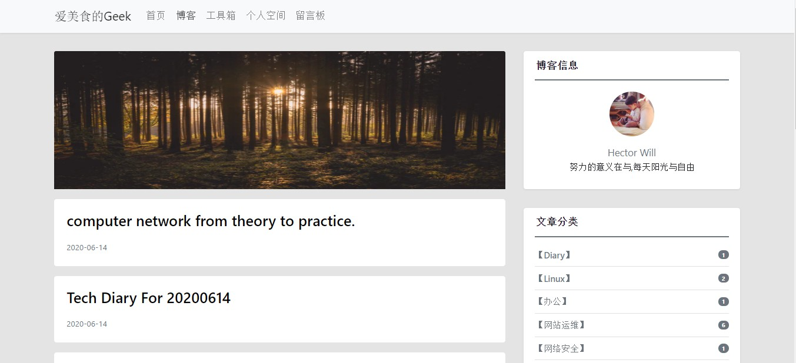

## 介绍
<p align="center">
	<a href="jiangyongxu.club"></a>
	<h3 align="center">WorkBench</h3>
	<p align="center">WorkBench is a smart work place.</p>
</p>


[](https://dev.azure.com/1830500370/workbench/_build/latest?definitionId=10&branchName=master)


------

 Based on vue's personal blog project, the backend uses django and golang, mainly used for blog publishing and project experience.基于vue的个人博客项目，后端采用了django与golang，主要用于博客发布，生活分享与项目体验.

**体验：[https://jiangyongxu.club/#/article](https://jiangyongxu.club/#/article)**


## 依赖
+ golang,gin
+ vue,vue-cli4.0,typescript
+ python django
+ redis
+ nginx
+ java,hadoop


## 已完成

+ 基本博客发布



+ 后台管理


## 计划功能

+ 博客图片发布
+ 支持侧边栏目录
+ 文章支持标签
+ 文章评论
+ 支持搜索
+ 文章加载优化，项目整体加载优化
+ 文章支持插入视频
+ nginx优化
+ 能够直接体验的文章，旁边有控制台可直接操作

+ 首页展示

+ 个人空间

  ```
  项目展示：项目展示视频，介绍
  个人简历
  未来规划
  打卡功能:统计，提醒
  ```

+ 留言板

+ 工具箱

  ```
  分享工具
  ```

+ 工作台：一些在线操作的工具（考虑与工具箱结合）

  ```
  如：
  在线加解密
  在线OJ
  在线可视化
  在线人工智能：可与算法结合如一些拓扑图等等
  在线仿真模拟：利用某个领域的基础原理，来模拟一些实验
  在线爬虫：面向个人的在线爬虫
  网络安全：相关实战项目体验
  ```

+ 项目首页与个人情况结合，给人一种直观感受，直接了解个人

## 总体优化

+ 网站安全优化

